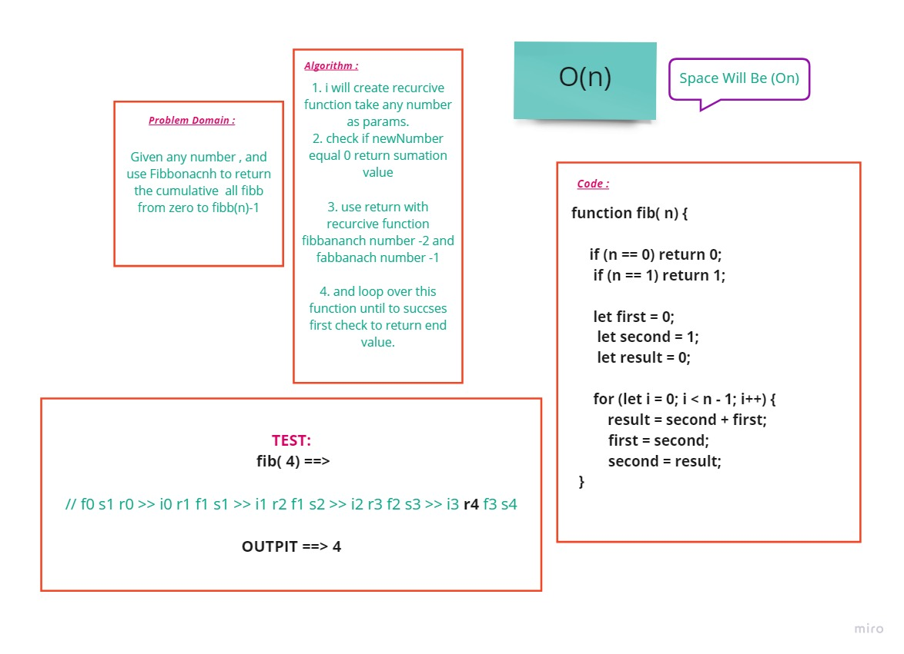

# Fibonacci
---
### **Description**
### This function take an number ,and return Fibonacci for these number.
---
### **Whiteboard Process** 

### **Approach & Efficiency** 

### Complixity (On) ---> Because in my algorithm need to loop over all element.
### TimeSpace (On).

---

[Home Page](../README.md)