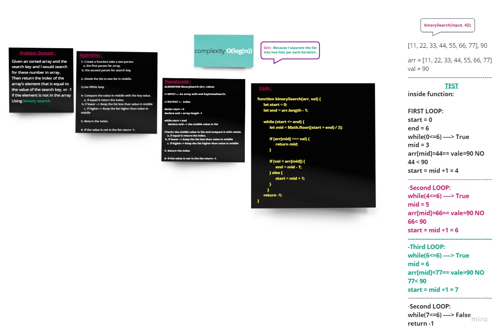

# Array Binary Search
---
### **Description**
### This function take an Sorted array and value params and return the index of the value inside array.
---
### **Whiteboard Process** 

### **Approach & Efficiency** 

### **O(log(n))** ---> Because in my algorithm separated the list into two lists and keep the specific div list under the condition per each iteration.
---

[Home Page](../README.md)

---
