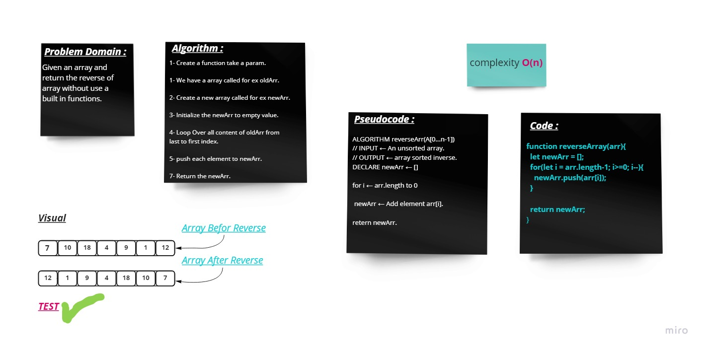

# Reverse an Array
---
### **Description**
### This function take an array for reverse the array's elements and return reverse array.
---
### **Whiteboard Process** 

### **Approach & Efficiency** 

### (On) ---> Because in my algorithm need to loop over all element to put them in a new array in the specific way(Reverse).

---

[Home Page](../README.md)

---