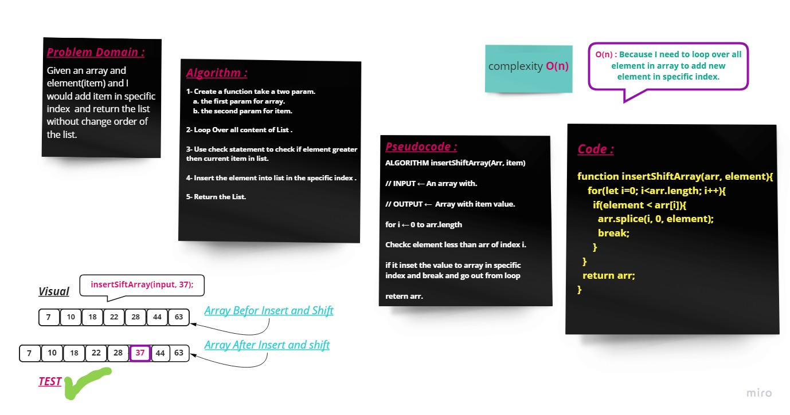

# Array Insert Shift
---
### **Description**
### This function take an array and element params and return sorted array with add an element and keeping the array in order.
---
### **Whiteboard Process** 

### **Approach & Efficiency** 

### (On) ---> Because in my algorithm need to loop over all element to put the new item in index and keeping the array in order.